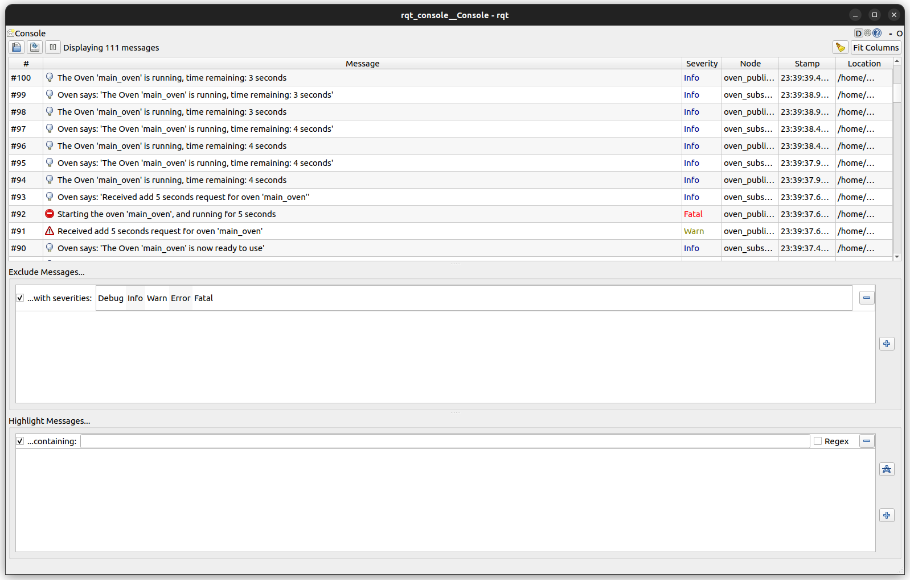

# Overview

This repository is a part of assignment for the course enom700 - Software Development for Robotics course. 
In here I go through ros2 tutorials, and build the basic foundation topics of ros2.

## Building and Running the code

```bash
# Setup the directory structure and clone the repository
mkdir -p ~/ros2_ws/src
cd ~/ros2_ws/src/
git clone https://github.com/AakashDammala/my_beginner_tutorials.git beginner_tutorials
cd ~/ros2_ws

# build the package and generate a symlink to the compile_commands.json file
colcon build --cmake-args -DCMAKE_EXPORT_COMPILE_COMMANDS=ON --symlink-install
ln -s ~/ros2_ws/build/beginner_tutorials/compile_commands.json src/beginner_tutorials/compile_commands.json

source install/setup.bash

# To start the oven_publisher node
ros2 run beginner_tutorials oven_publisher

# To start the oven_subscriber node
ros2 run beginner_tutorials oven_subscriber

# To launch both publisher and subscriber nodes, while passing a cli parameter
ros2 launch beginner_tutorials start_oven.launch.py oven_name:='<oven-name-here>'

# Call service to start oven for 5 seconds / add 5 seconds to already running oven
ros2 service call /add_5_sec std_srvs/srv/Trigger {} 
```

## Directory structure

```bash
├── beginner_tutorials
│   ├── CMakeLists.txt
│   ├── compile_commands.json
│   ├── .clang-format
│   ├── LICENSE
│   ├── package.xml
│   └── src
│       └── publisher_member_function.cpp
├── LICENSE
└── readme.md
```

## Screenshot

RQT screenshot showing more than 2 different log levels




## Assumptions / Dependencies

1. ROS2 humble should be installed. Follow this [link](https://docs.ros.org/en/humble/Installation.html) if not installed.
2. 'std_msgs' package should be installed. If not installed, run `sudo apt install ros-humble-std-msgs`

## References

The code in this repository is built based on [ros humble tutorials](https://docs.ros.org/en/humble/Tutorials.html)

